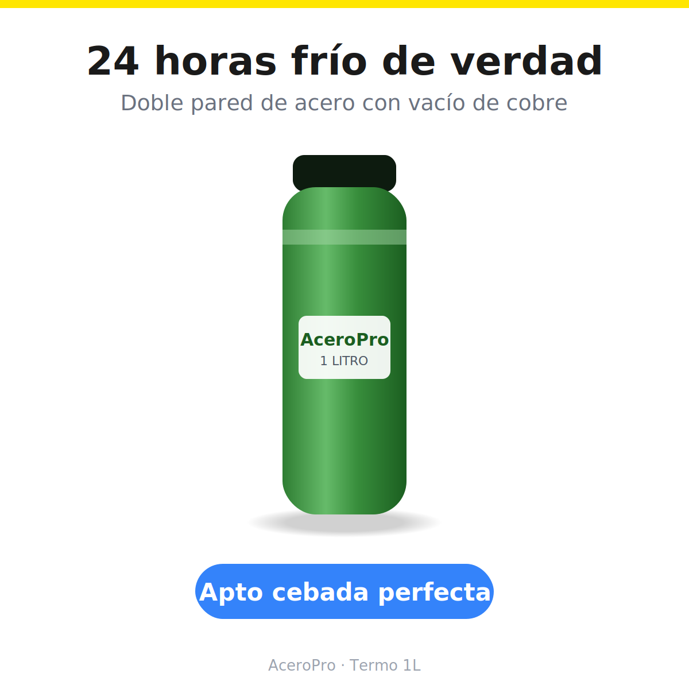
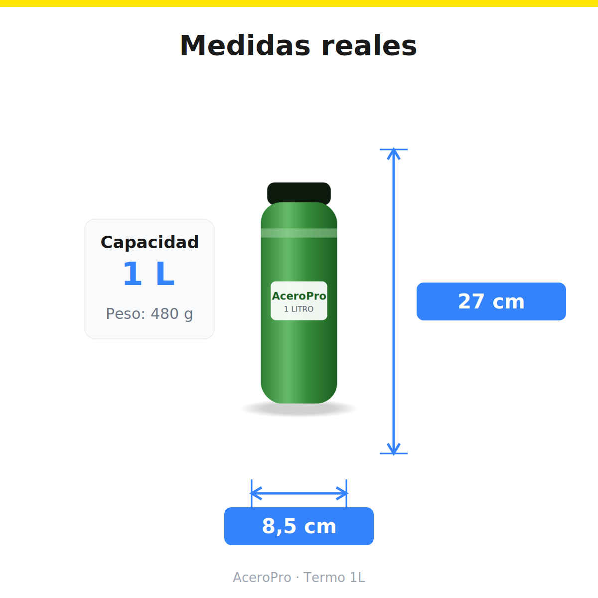

# MCP de MercadoLibre para vendedores — conectá tu tienda a Claude sin servidor

[](https://github.com/kokesaurio/mercadolibre-sellers-mcp-algoritmo-Digital/actions)
[](CHANGELOG.md)
[](LICENSE)
[](https://github.com/kokesaurio/mercadolibre-sellers-mcp-algoritmo-Digital/stargazers)

**Palabras clave:** MCP MercadoLibre · MercadoLibre Claude · conectar MercadoLibre a Claude · API MercadoLibre IA · Model Context Protocol MercadoLibre · vendedores MercadoLibre · automatizar MercadoLibre con IA

Conectá tu cuenta de MercadoLibre a Claude y manejá tu tienda en lenguaje natural:

- *"¿cómo vienen las ventas hoy?"* → tablero con facturación, top productos, envíos y provincias
- *"¿qué preguntas tengo sin responder?"* → te propone todas las respuestas y publica las que apruebes
- *"auditá mis publicaciones"* → semáforo 🔴🟡🟢 con qué arreglar en cada una (fotos, título, video faltante, catálogo)
- *"armame las imágenes de esta publicación"* → el set de 4 infografías profesionales con tus fotos reales
- *"hacé un video para Reels de este producto"* → guion por escenas y video con tus datos verdaderos
- *"¿qué cambió en la competencia?"* → solo las novedades: precios movidos, publicaciones nuevas, ventas estimadas del rival

**27 herramientas · 16 skills · multicuenta con consolidado · sin servidor propio · tokens solo en tu computadora** — hecho por [Algoritmo Digital](https://algoritmodigital.com.ar), consultora especializada en MercadoLibre.

```text
Claude ──MCP──► este conector ──OAuth 2.0 + PKCE──► API oficial de MercadoLibre
```

> ⭐ **¿Te sirve el conector?** [Dejanos una estrella](https://github.com/kokesaurio/mercadolibre-sellers-mcp-algoritmo-Digital/stargazers) — es gratis para vos y hace que más vendedores lo encuentren en GitHub y Google.

## Por qué este y no otro

| | Este conector | Alternativas típicas |
| --- | --- | --- |
| Onboarding | **Guiado desde cero**: decile "setup" a Claude y te deja operativo | Asumen que ya tenés los tokens de ML (conseguirlos es la parte difícil) o exigen una base Supabase |
| Infraestructura | **Ninguna**: tokens en un archivo local (0600), refresh automático serializado | Backend propio, Supabase o VPS |
| Idioma | Castellano, pensado para vendedores | Inglés técnico, pensado para developers |
| Seguridad | PKCE, escrituras opcionales (`ML_SOLO_LECTURA=1` las desactiva), sin telemetría | Varía |
| Pruebas | **Suite E2E de 42 casos** contra un MercadoLibre simulado, corriendo en CI en cada cambio | Rara vez |
| Skills | **16 skills** incluidas, del reporte diario al video del producto | No |

¿Tenés varias tiendas, querés rentabilidad real con tus costos, caja de MercadoPago y vigilancia de competidores gestionada? Eso es nuestro [conector premium con CRM](https://github.com/kokesaurio/mercadolibre-algoritmodigital) — este conector directo es gratis y para cualquier vendedor.

## Guía de instalación (10 minutos, sin servidor, paso a paso)

No hace falta saber programar. Necesitás: una cuenta de vendedor de MercadoLibre, [Claude Desktop](https://claude.ai/download) y [Node.js LTS](https://nodejs.org) instalados (ambos gratis, se instalan con "siguiente, siguiente").

### ⚡ Vía rápida A — Instalador automático (1 solo comando)

Abrí una terminal (**Windows**: `Win + R` → escribí `cmd` → Enter · **Mac**: app Terminal) y pegá:

```bash
npx -y github:kokesaurio/mercadolibre-sellers-mcp-algoritmo-Digital instalar
```

El instalador te guía para crear tu app gratis de MercadoLibre, te pide el App ID y el Secret, y **configura Claude Desktop solo**: respeta los conectores que ya tengas, hace backup de tu configuración anterior y te deja a un reinicio de usarlo. (Si ya tenés las credenciales: agregá `--app-id TU_APP_ID --secret TU_SECRET`.)

### ⚡ Vía rápida B — Que Claude lo instale por vos (Cowork / Claude Code)

¿Usás Claude Cowork o Claude Code? Pegale este prompt tal cual y listo:

```text
Instalame el conector de MercadoLibre de Algoritmo Digital:
1. Si todavía no tengo App ID y Secret, guiame a crearlos gratis en
   https://developers.mercadolibre.com.ar (app nueva, URI de redirect EXACTA
   https://kokesaurio.github.io/mercadolibre-sellers-mcp-algoritmo-Digital/conectar.html
   y scopes read, write y offline_access) y pedímelos.
2. Ejecutá: npx -y github:kokesaurio/mercadolibre-sellers-mcp-algoritmo-Digital instalar --app-id <MI_APP_ID> --secret <MI_SECRET>
3. Verificá que claude_desktop_config.json quedó con el conector "mercadolibre"
   y avisame que reinicie Claude Desktop.
4. Después del reinicio te digo "conectá mi cuenta de MercadoLibre" y me guiás.
Guía: https://github.com/kokesaurio/mercadolibre-sellers-mcp-algoritmo-Digital
```

### Vía manual paso a paso (con imágenes)

¿Preferís hacerlo a mano o entender cada paso? Seguí la guía ilustrada:

### Paso 1 — Creá tu aplicación gratis en MercadoLibre

Entrá a [developers.mercadolibre.com.ar](https://developers.mercadolibre.com.ar) con tu cuenta de vendedor → **Mis aplicaciones** → **Crear nueva aplicación** y completá así:


- **URI de redirect** (el campo que más errores causa — copiala exacta, sin barra final):

  ```
  https://kokesaurio.github.io/mercadolibre-sellers-mcp-algoritmo-Digital/conectar.html
  ```

- **Scopes**: marcá `read`, `write` y **`offline_access`** — sin este último, la conexión se corta cada 6 horas.

### Paso 2 — Anotá el App ID y el Secret Key

Al guardar, MercadoLibre te muestra los dos datos que van en Claude:


⚠️ El **Secret Key** es como una contraseña: no lo compartas ni lo publiques.

### Paso 3 — Agregá el conector a Claude Desktop

Abrí el archivo de configuración:

- **Windows**: apretá `Win + R`, pegá `%APPDATA%\Claude\claude_desktop_config.json` y Enter (se abre con el Bloc de notas).
- **Mac**: Claude Desktop → Settings → Developer → **Edit Config**.


Si el archivo está vacío, pegá este bloque completo (reemplazando tus dos datos del paso 2). Si ya tenés otros conectores, agregá solo la parte `"mercadolibre"`:

```json
{
  "mcpServers": {
    "mercadolibre": {
      "command": "npx",
      "args": ["-y", "github:kokesaurio/mercadolibre-sellers-mcp-algoritmo-Digital"],
      "env": {
        "ML_APP_ID": "TU_APP_ID",
        "ML_APP_SECRET": "TU_SECRET_KEY"
      }
    }
  }
}
```

Guardá y **reiniciá Claude Desktop** (cerralo del todo y volvé a abrirlo).

**¿Usás Claude Code?** Un solo comando:

```bash
claude mcp add mercadolibre \
  -e ML_APP_ID=TU_APP_ID -e ML_APP_SECRET=TU_SECRET_KEY \
  -- npx -y github:kokesaurio/mercadolibre-sellers-mcp-algoritmo-Digital
```

### Paso 4 — Conectá tu cuenta (una sola vez)

En un chat nuevo decile a Claude: **"conectá mi cuenta de MercadoLibre"** — o directamente **"setup"** para que la skill de puesta en marcha haga todo esto por vos.


1. Claude te da un link → abrilo e iniciá sesión con **tu** cuenta de vendedor.
2. Tocá **Autorizar** → la página te muestra un código.
3. **Copiá el código y pegáselo a Claude.** Listo: la sesión se renueva sola para siempre. ¿Más de una tienda? Repetí este paso con cada cuenta.

### Si algo falla (los 5 errores clásicos)

| Síntoma | Causa y solución |
| --- | --- |
| El conector no aparece en Claude | Claude no se reinició del todo (en Windows, cerralo también desde la bandeja junto al reloj), o el JSON quedó mal (una coma de más). Validá el archivo en jsonlint.com |
| "Faltan ML_APP_ID y ML_APP_SECRET" | Quedaron los textos `TU_APP_ID` / `TU_SECRET_KEY` sin reemplazar en el config |
| MercadoLibre dice "invalid redirect_uri" | La URI en tu app del DevCenter no es idéntica a la del paso 1 (revisá mayúsculas y que no tenga barra final) |
| "code inválido" al pegar el código | El código vence en minutos y es de un solo uso: repetí "conectá mi cuenta" y pegá el nuevo |
| La conexión se corta a las horas | Faltó el scope `offline_access` en la app: agregalo en el DevCenter y volvé a conectar |

¿Seguís trabado? [Escribinos por WhatsApp](https://wa.me/5491177166060?text=Hola!%20Vengo%20del%20conector%20MCP%20de%20MercadoLibre%20(instalaci%C3%B3n)...) y te ayudamos.

## Las 14 skills — tu equipo de trabajo

El conector trae [**16 skills listas**](skills/) con [guía de uso de cada una](skills/README.md). Se suben una vez en Claude (**Configuración → Capacidades → Skills → Cargar skill**) y convierten las herramientas en flujos completos: vos pedís en una frase, la skill sabe el procedimiento.

> 🚀 **Empezá por acá:** subí [setup-ml](skills/setup-ml/) y decile a Claude **"setup"** — conecta tus cuentas, arma la vigilancia inicial y te entrega tu primera foto del negocio con las 3 acciones más urgentes.

### 📊 Operación diaria

| Skill | Pedila así |
| --- | --- |
| [panel-ventas-ml](skills/panel-ventas-ml/) | *"¿cómo venimos hoy?"* — facturación de hoy y del mes, top productos, envíos FULL/Flex/Colecta y provincias |
| [reporte-ventas-ml](skills/reporte-ventas-ml/) | *"reporte de ventas"* — el resumen de 4 líneas apto WhatsApp |
| [responder-preguntas-ml](skills/responder-preguntas-ml/) | *"respondamos las preguntas"* — todas las respuestas propuestas juntas, publica solo lo que apruebes |

### 🔍 Optimización de publicaciones

| Skill | Pedila así |
| --- | --- |
| [mejorar-publicaciones-ml](skills/mejorar-publicaciones-ml/) | *"auditá mis publicaciones"* — semáforo 🔴🟡🟢 con la acción concreta por ítem, las peores primero |
| [visualizador-publicaciones-ml](skills/visualizador-publicaciones-ml/) | *"armame el visualizador"* — [tablero interactivo](panel/visualizador.html) con foto y semáforo: tocás cuáles mejorar y te genera el pedido |
| [copiar-publicaciones-ml](skills/copiar-publicaciones-ml/) | *"copiá esta publicación a la otra tienda"* — clona entre tus cuentas; lo ajeno se redacta, nunca se clona |
| [revisar-publicaciones-aldi](skills/revisar-publicaciones-aldi/) | *"pasá esta publicación por Aldi"* — segunda opinión con [Aldi 2.0](https://chatgpt.com/g/g-698f16e0eebc819182455494732d40a0-aldi-2-0-mercado-libre-algoritmo-digital), el GPT revisor de Algoritmo Digital |

### 🎨 Kit creativo: imágenes y videos

| Skill | Pedila así |
| --- | --- |
| [imagenes-ml](skills/imagenes-ml/) | *"armame las imágenes de MLA..."* — el set fijo de 4 infografías con tus fotos reales (abajo hay ejemplos) |
| [video-publicaciones-ml](skills/video-publicaciones-ml/) | *"hacé un video para Reels de MLA..."* — guion por escenas y producción con HyperFrames desde datos reales |
| [clips-ml](skills/clips-ml/) | *"¿qué clips tengo?"* — mapa de Clips de la tienda, estado de moderación con motivos, y subida por API validando los requisitos de ML |
| [ugc-ml](skills/ugc-ml/) | *"hacé un UGC de este producto"* — estilo usuario real con avatar de IA siempre y castellano latino neutro |

### 🥊 Competencia y crecimiento

| Skill | Pedila así |
| --- | --- |
| [descubrir-ganadores-ml](skills/descubrir-ganadores-ml/) | *"¿qué conviene vender?"* — más vendidos oficiales por categoría, tendencias y análisis de mercado por keyword, validado por margen |
| [vigilancia-ml](skills/vigilancia-ml/) | *"¿qué cambió en la competencia?"* — solo novedades: precios movidos, publicaciones nuevas, ventas estimadas del rival, keywords en alza |
| [competencia-ml](skills/competencia-ml/) | *"¿estoy ganando el catálogo?"* — semáforo de precios y buy box, con recomendaciones validadas por margen |
| [publicidad-ml](skills/publicidad-ml/) | *"revisemos la publicidad"* — Product Ads con regla ACOS vs margen y promociones separando tu aporte del de ML |
| [setup-ml](skills/setup-ml/) | *"setup"* — la puesta en marcha guiada de todo lo anterior |

**Rutina sugerida:** diaria = panel + preguntas (5 min) · semanal = vigilancia → visualizador → mejoras → publicidad · al publicar algo nuevo = copiar → imágenes → video → revisión con Aldi.

## El set de imágenes de venta (así salen)

La skill imagenes-ml genera el **set fijo de 4** — beneficio (foto 2), características (foto 4), medidas con cotas (foto 5) y qué incluye (foto 6) — en 1200×1200, **con las fotos reales de tu publicación incrustadas** y cumpliendo las reglas de imágenes de MercadoLibre (sin datos de contacto, sin "OFERTA", legible en miniatura):

| Foto 2 — Beneficio | Foto 5 — Medidas |
| --- | --- |
|  |  |

Las [plantillas](plantillas/) son SVG paramétricos y el generador es un comando: `python3 plantillas/generar.py --plantilla medidas --datos datos.json --foto tu-foto.png --salida foto-5-medidas.png`. El método completo (orden de publicación foto 2→10, solo datos confirmados, revisión pieza por pieza) está grabado en la skill.

## Herramientas (27)

| Herramienta | Qué hace |
| --- | --- |
| ml_conectar / ml_cuentas / ml_desconectar | Vincular varias tiendas, elegir la predeterminada (⭐) y desconectar |
| ml_ordenes | Ventas con filtros de fecha y estado |
| ml_panel_ventas | El tablero completo: facturación de hoy y del mes, top productos, métodos de envío y en qué provincias se concentra la venta |
| ml_metricas | Facturación, unidades y ticket vs período anterior; con `cuenta="todas"` consolida todas tus tiendas |
| ml_envios | Estado y tracking del envío de una orden |
| ml_publicaciones / ml_publicacion | Tus publicaciones y su detalle (incluye fotos y si tiene video) |
| ml_auditar_publicaciones | Semáforo 🔴🟡🟢 de TUS publicaciones con cómo mejorar cada una: título, fotos, descripción, envío, stock, **video faltante**, tipo y catálogo — las peores primero |
| ml_visitas | Tráfico de una publicación |
| ml_actualizar_publicacion ✏️ | Cambiar precio, stock o pausar/activar |
| ml_crear_publicacion ✏️ | Crear una publicación nueva, o clonar una existente (`copiar_de`) — ideal para duplicar entre tus tiendas |
| ml_preguntas / ml_responder_pregunta ✏️ | Ver y responder preguntas de compradores |
| ml_comisiones | Cuánto cobra ML por vender a un precio dado |
| ml_precio_catalogo | Si ganás la buy box del catálogo y qué precio la gana |
| ml_buscar | Espiar competencia y precios de mercado |
| ml_reputacion | Color, reclamos, demoras y cancelaciones |
| ml_promociones / ml_aceptar_promocion ✏️ | Promociones ofrecidas y aceptación por ítem |
| ml_tendencias | Qué está buscando la gente en ML |
| ml_descubrir_ganadores | Artículos ganadores con datos de la API: ranking oficial de más vendidos por categoría (highlights) + análisis de mercado por keyword (competencia, precios, dominancia, señal de oportunidad) |
| ml_vigilar / ml_novedades_competencia | Lista de rivales 🥊, productos seguidos 📦, búsquedas y trends — y el control que reporta solo lo que cambió: precios, publicaciones nuevas, ventas estimadas del rival, cambios de líder y keywords en alza |
| ml_historial_competencia | La base de datos de competencia: evolución de precios, ventas y líderes de cada objetivo vigilado — se alimenta sola con cada control |
| ml_clips | Los Clips (videos verticales) de tus publicaciones y cuáles sirven: mapa de la tienda + estado de moderación por clip (publicado/en revisión/rechazado con el motivo y cómo corregirlo) |
| ml_subir_clip ✏️ / ml_borrar_clip ✏️ | Subir un clip por API (valida formato, duración y peso antes) y borrar los rechazados para resubir corregidos |
| ml_version | Versión instalada, chequeo de actualizaciones y cómo actualizar |

✏️ = escribe en tu tienda real. Claude siempre pide confirmación antes, y con `ML_SOLO_LECTURA=1` esas 7 herramientas directamente no existen.

## Varias tiendas

Corré `ml_conectar` una vez por cada cuenta. Todas las herramientas aceptan `cuenta` (el user_id) para elegir tienda; sin indicarla se usa la **predeterminada** (⭐, se cambia con `ml_cuentas`), y si hay varias sin predeterminada el conector pide elegir en vez de adivinar — nunca opera en la tienda equivocada. *"¿Cómo vienen las ventas de todas las tiendas?"* usa el consolidado.

## Actualizaciones

El conector se chequea solo contra GitHub (una vez por día, sin enviar ningún dato): cuando publicamos una mejora, **la primera respuesta de tu sesión te avisa** que hay versión nueva. También podés preguntarle a Claude *"¿qué versión del conector tengo?"* (`ml_version`). Para actualizar:

```bash
npx -y github:kokesaurio/mercadolibre-sellers-mcp-algoritmo-Digital actualizar
```

…y reiniciá Claude: al arrancar baja la última versión automáticamente. Historial de cambios en el [CHANGELOG](CHANGELOG.md) y en los [releases](https://github.com/kokesaurio/mercadolibre-sellers-mcp-algoritmo-Digital/releases).

## Seguridad

- OAuth 2.0 **con PKCE**; los tokens viven en `~/.meli-sellers-mcp/cuentas.json` con permisos 0600, en tu máquina y en ningún otro lado.
- El refresh token de ML es de un solo uso: el conector serializa los refresh (single-flight) para que dos llamadas concurrentes no revoquen tu cuenta.
- La página del código de autorización es estática (GitHub Pages) y no envía nada a ningún servidor.
- Cero telemetría, cero base de datos externa.
- ¿Encontraste una vulnerabilidad? Leé la [política de seguridad](SECURITY.md) — reporte privado, respuesta en 72 hs.

## Desarrollo y comunidad

```bash
npm install
npm test      # 42 pruebas E2E contra un MercadoLibre simulado
npm run dev   # levanta el simulado en :9990 (conectar con code CODE-OK)
```

Cada push corre la suite completa en [GitHub Actions](https://github.com/kokesaurio/mercadolibre-sellers-mcp-algoritmo-Digital/actions). ¿Querés sumar algo? Leé [cómo contribuir](CONTRIBUTING.md) — regla de oro: todo cambio deja `npm test` en verde y cada funcionalidad nueva trae su caso E2E. ¿Encontraste un error o te falta una herramienta? [Abrí un issue](https://github.com/kokesaurio/mercadolibre-sellers-mcp-algoritmo-Digital/issues/new/choose).

## ¿Querés más?

Algoritmo Digital hace [consultoría, gestión de cuentas y desarrollo a medida sobre MercadoLibre](https://algoritmodigital.com.ar) hace más de 15 años. Escribinos: [WhatsApp](https://wa.me/5491177166060?text=Hola!%20Vengo%20del%20conector%20MCP%20de%20MercadoLibre%20(GitHub)...)

## Licencia

MIT — Algoritmo Digital.
