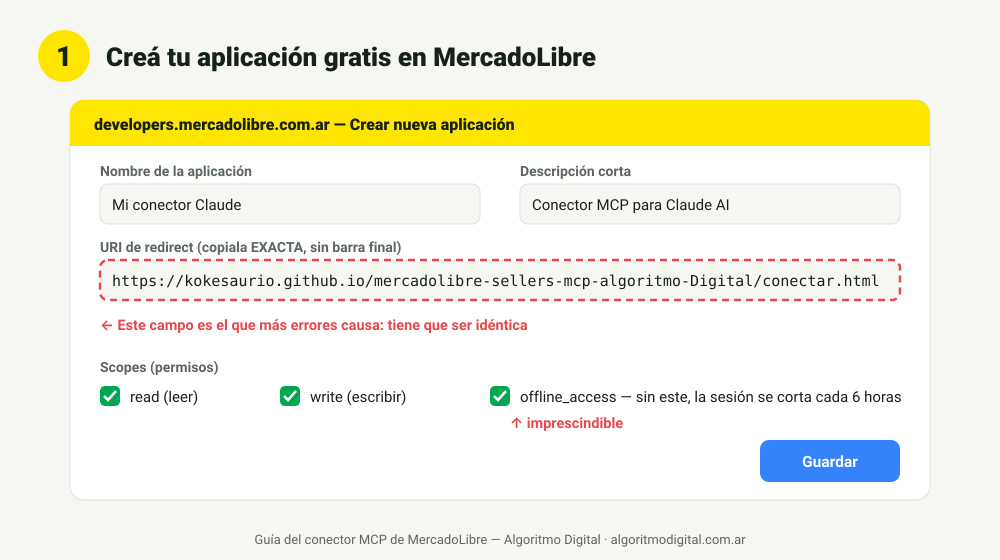
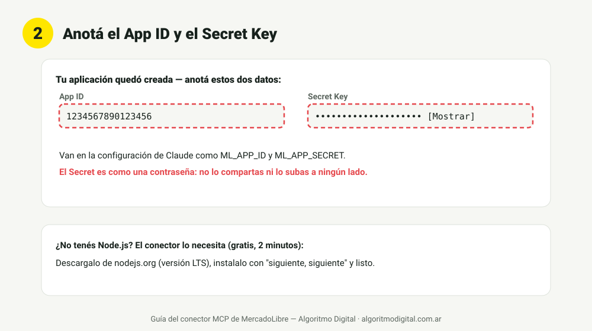
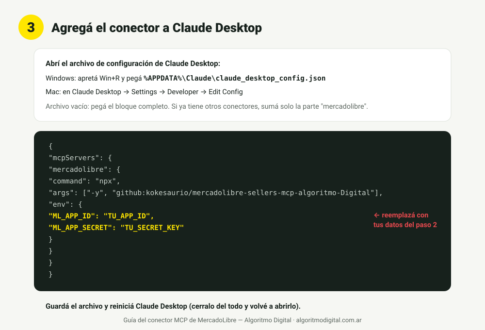
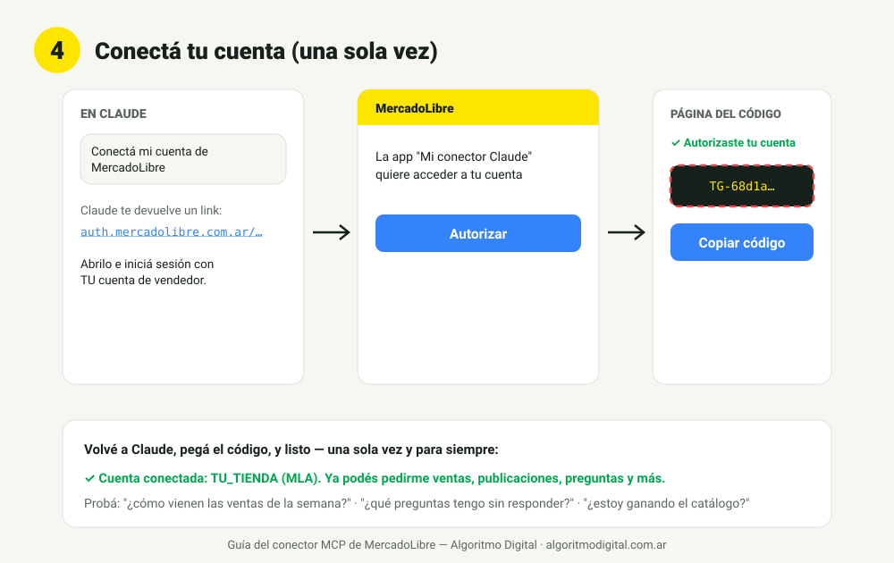

# MCP de MercadoLibre para vendedores — conectá tu tienda a Claude sin servidor

**Palabras clave:** MCP MercadoLibre · MercadoLibre Claude · conectar MercadoLibre a Claude · API MercadoLibre IA · Model Context Protocol MercadoLibre · vendedores MercadoLibre · automatizar MercadoLibre con IA

Conectá tu cuenta de MercadoLibre a Claude y preguntale en lenguaje natural:
*"¿cómo vienen las ventas?"*, *"¿qué preguntas tengo sin responder?"*, *"¿estoy
ganando el catálogo?"*, *"¿qué promociones me está ofreciendo MercadoLibre?"*.

**22 herramientas · multicuenta (varias tiendas, con consolidado) · sin servidor propio · tokens guardados solo en tu computadora
· hecho por [Algoritmo Digital](https://algoritmodigital.com.ar), consultora
especializada en MercadoLibre.**

```text
Claude ──MCP──► este conector ──OAuth 2.0 + PKCE──► API oficial de MercadoLibre
```

## Por qué este y no otro

| | Este conector | Alternativas típicas |
| --- | --- | --- |
| Onboarding | **Guiado desde cero**: `ml_conectar` te da el link, autorizás y pegás el código. Listo. | Asumen que ya tenés los tokens de ML (conseguirlos es la parte difícil) o exigen una base Supabase |
| Infraestructura | **Ninguna**: tokens en un archivo local (0600), refresh automático serializado | Backend propio, Supabase o VPS |
| Idioma | Castellano, pensado para vendedores | Inglés técnico, pensado para developers |
| Seguridad | PKCE, escrituras opcionales (`ML_SOLO_LECTURA=1` las desactiva), sin telemetría | Varía |
| Pruebas | Suite E2E de 21 casos contra un MercadoLibre simulado (`npm test`) | Rara vez |
| Skills | 5 skills de Claude incluidas (reportes, preguntas, competencia, publicidad, optimización) | No |

¿Tenés varias tiendas, querés rentabilidad real con tus costos, caja de
MercadoPago y vigilancia de competidores gestionada? Eso es nuestro
[conector premium con CRM](https://github.com/kokesaurio/mercadolibre-algoritmodigital)
— este conector directo es gratis y para cualquier vendedor.

## Guía de instalación (10 minutos, sin servidor, paso a paso)

No hace falta saber programar. Necesitás: una cuenta de vendedor de MercadoLibre,
[Claude Desktop](https://claude.ai/download) y [Node.js LTS](https://nodejs.org)
instalados (ambos gratis, se instalan con "siguiente, siguiente").

### ⚡ Vía rápida A — Instalador automático (1 solo comando)

Abrí una terminal (**Windows**: `Win + R` → escribí `cmd` → Enter · **Mac**: app Terminal) y pegá:

```bash
npx -y github:kokesaurio/mercadolibre-sellers-mcp-algoritmo-Digital instalar
```

El instalador te guía para crear tu app gratis de MercadoLibre, te pide el App
ID y el Secret, y **configura Claude Desktop solo**: respeta los conectores que
ya tengas, hace backup de tu configuración anterior y te deja a un reinicio de
usarlo. (Si ya tenés las credenciales: agregá `--app-id TU_APP_ID --secret TU_SECRET`.)

### ⚡ Vía rápida B — Que Claude lo instale por vos (Cowork / Claude Code)

¿Usás Claude Cowork o Claude Code? Pegale este prompt tal cual y listo:

```text
Instalame el conector de MercadoLibre de Algoritmo Digital:
1. Si todavía no tengo App ID y Secret, guiame a crearlos gratis en
   https://developers.mercadolibre.com.ar (app nueva, URI de redirect EXACTA
   https://kokesaurio.github.io/mercadolibre-sellers-mcp-algoritmo-Digital/conectar.html
   y scopes read, write y offline_access) y pedímelos.
2. Ejecutá: npx -y github:kokesaurio/mercadolibre-sellers-mcp-algoritmo-Digital instalar --app-id <MI_APP_ID> --secret <MI_SECRET>
3. Verificá que claude_desktop_config.json quedó con el conector "mercadolibre"
   y avisame que reinicie Claude Desktop.
4. Después del reinicio te digo "conectá mi cuenta de MercadoLibre" y me guiás.
Guía: https://github.com/kokesaurio/mercadolibre-sellers-mcp-algoritmo-Digital
```

### Vía manual paso a paso (con imágenes)

¿Preferís hacerlo a mano o entender cada paso? Seguí la guía ilustrada:

### Paso 1 — Creá tu aplicación gratis en MercadoLibre

Entrá a [developers.mercadolibre.com.ar](https://developers.mercadolibre.com.ar)
con tu cuenta de vendedor → **Mis aplicaciones** → **Crear nueva aplicación** y
completá así:



- **URI de redirect** (el campo que más errores causa — copiala exacta, sin barra final):

  ```
  https://kokesaurio.github.io/mercadolibre-sellers-mcp-algoritmo-Digital/conectar.html
  ```

- **Scopes**: marcá `read`, `write` y **`offline_access`** — sin este último, la
  conexión se corta cada 6 horas.

### Paso 2 — Anotá el App ID y el Secret Key

Al guardar, MercadoLibre te muestra los dos datos que van en Claude:



⚠️ El **Secret Key** es como una contraseña: no lo compartas ni lo publiques.

### Paso 3 — Agregá el conector a Claude Desktop

Abrí el archivo de configuración:

- **Windows**: apretá `Win + R`, pegá `%APPDATA%\Claude\claude_desktop_config.json` y Enter (se abre con el Bloc de notas).
- **Mac**: Claude Desktop → Settings → Developer → **Edit Config**.



Si el archivo está vacío, pegá este bloque completo (reemplazando tus dos datos
del paso 2). Si ya tenés otros conectores, agregá solo la parte `"mercadolibre"`:

```json
{
  "mcpServers": {
    "mercadolibre": {
      "command": "npx",
      "args": ["-y", "github:kokesaurio/mercadolibre-sellers-mcp-algoritmo-Digital"],
      "env": {
        "ML_APP_ID": "TU_APP_ID",
        "ML_APP_SECRET": "TU_SECRET_KEY"
      }
    }
  }
}
```

Guardá y **reiniciá Claude Desktop** (cerralo del todo y volvé a abrirlo).

**¿Usás Claude Code?** Un solo comando:

```bash
claude mcp add mercadolibre \
  -e ML_APP_ID=TU_APP_ID -e ML_APP_SECRET=TU_SECRET_KEY \
  -- npx -y github:kokesaurio/mercadolibre-sellers-mcp-algoritmo-Digital
```

### Paso 4 — Conectá tu cuenta (una sola vez)

En un chat nuevo decile a Claude: **"conectá mi cuenta de MercadoLibre"**.



1. Claude te da un link → abrilo e iniciá sesión con **tu** cuenta de vendedor.
2. Tocá **Autorizar** → la página te muestra un código.
3. **Copiá el código y pegáselo a Claude.** Listo: la sesión se renueva sola para
   siempre. ¿Más de una tienda? Repetí este paso con cada cuenta.

Probá: *"¿cómo vienen las ventas de la semana?"*, *"¿qué preguntas tengo sin
responder?"*, *"¿estoy ganando el catálogo?"*.

### Si algo falla (los 5 errores clásicos)

| Síntoma | Causa y solución |
| --- | --- |
| El conector no aparece en Claude | Claude no se reinició del todo (en Windows, cerralo también desde la bandeja junto al reloj), o el JSON quedó mal (una coma de más). Validá el archivo en jsonlint.com |
| "Faltan ML_APP_ID y ML_APP_SECRET" | Quedaron los textos `TU_APP_ID` / `TU_SECRET_KEY` sin reemplazar en el config |
| MercadoLibre dice "invalid redirect_uri" | La URI en tu app del DevCenter no es idéntica a la del paso 1 (revisá mayúsculas y que no tenga barra final) |
| "code inválido" al pegar el código | El código vence en minutos y es de un solo uso: repetí "conectá mi cuenta" y pegá el nuevo |
| La conexión se corta a las horas | Faltó el scope `offline_access` en la app: agregalo en el DevCenter y volvé a conectar |

¿Seguís trabado? [Escribinos por WhatsApp](https://wa.me/5491177166060?text=Hola!%20Vengo%20del%20conector%20MCP%20de%20MercadoLibre%20(instalaci%C3%B3n)...) y te ayudamos.

## Herramientas (22)

| Herramienta | Qué hace |
| --- | --- |
| ml_conectar / ml_cuentas / ml_desconectar | Vincular varias tiendas, elegir la predeterminada (⭐) y desconectar |
| ml_ordenes | Ventas con filtros de fecha y estado |
| ml_panel_ventas | El tablero completo: facturación de hoy y del mes, top productos, métodos de envío y en qué provincias se concentra la venta |
| ml_metricas | Facturación, unidades y ticket vs período anterior; con `cuenta="todas"` consolida todas tus tiendas |
| ml_envios | Estado y tracking del envío de una orden |
| ml_publicaciones / ml_publicacion | Tus publicaciones y su detalle |
| ml_auditar_publicaciones | Semáforo 🔴🟡🟢 de TUS publicaciones con cómo mejorar cada una: título, fotos, descripción, envío, stock, tipo y catálogo — las peores primero |
| ml_visitas | Tráfico de una publicación |
| ml_actualizar_publicacion ✏️ | Cambiar precio, stock o pausar/activar |
| ml_crear_publicacion ✏️ | Crear una publicación nueva, o clonar una existente (`copiar_de`) — ideal para duplicar entre tus tiendas |
| ml_preguntas / ml_responder_pregunta ✏️ | Ver y responder preguntas de compradores |
| ml_comisiones | Cuánto cobra ML por vender a un precio dado |
| ml_precio_catalogo | Si ganás la buy box del catálogo y qué precio la gana |
| ml_buscar | Espiar competencia y precios de mercado |
| ml_reputacion | Color, reclamos, demoras y cancelaciones |
| ml_promociones / ml_aceptar_promocion ✏️ | Promociones ofrecidas y aceptación por ítem |
| ml_tendencias | Qué está buscando la gente en ML |
| ml_vigilar / ml_novedades_competencia | Lista de rivales 🥊, productos seguidos 📦, búsquedas y trends — y el control de competidores, publicaciones, búsquedas y trends — y el control que reporta solo lo que cambió: precios, publicaciones nuevas, ventas estimadas del rival, cambios de líder y keywords en alza |
| ml_version | Versión instalada, chequeo de actualizaciones y cómo actualizar |

✏️ = escribe en tu tienda real. Claude siempre pide confirmación antes, y con
`ML_SOLO_LECTURA=1` esas herramientas directamente no existen.

## Visualizador de publicaciones

En [`panel/visualizador.html`](panel/visualizador.html): todas tus
publicaciones en tarjetas con foto, precio, stock y semáforo de la auditoría —
tocás las que querés mejorar y te genera el pedido listo para pegarle a Claude.
La skill visualizador-publicaciones-ml lo llena con tus datos reales.

## Skills incluidas (11)

En [`skills/`](skills/) — con [índice propio y rutina sugerida](skills/README.md) — vienen 11 skills fijas para Claude (Configuración →
Capacidades → Skills → subir la carpeta) que convierten las herramientas en
flujos de trabajo completos:

| Skill | Qué hace |
| --- | --- |
| [panel-ventas-ml](skills/panel-ventas-ml/) | El tablero del día: facturación de hoy y del mes, más vendidos, envíos (FULL/Flex/Colecta) y provincias donde se concentra la venta, con lecturas accionables |
| [reporte-ventas-ml](skills/reporte-ventas-ml/) | El "¿cómo vienen las ventas?" diario: facturación, unidades y alertas en formato de 4 líneas apto celular |
| [responder-preguntas-ml](skills/responder-preguntas-ml/) | Junta las preguntas pendientes, propone TODAS las respuestas para aprobar de una, y publica solo lo confirmado — nunca datos de contacto |
| [mejorar-publicaciones-ml](skills/mejorar-publicaciones-ml/) | Diagnóstico con datos → priorización → propuestas de título/precio/stock → aplica solo con confirmación por ítem |
| [visualizador-publicaciones-ml](skills/visualizador-publicaciones-ml/) | Arma el [tablero interactivo](panel/visualizador.html) con foto, precio y semáforo de cada publicación: tocás cuáles mejorar y te genera el pedido para Claude |
| [imagenes-ml](skills/imagenes-ml/) | Genera las imágenes de venta (medidas con cotas, beneficios, qué incluye) desde las [plantillas](plantillas/) del repo, cumpliendo las reglas de imágenes de ML, y audita tu imagen principal |
| [copiar-publicaciones-ml](skills/copiar-publicaciones-ml/) | Duplica publicaciones entre tus tiendas (multicuenta) o crea nuevas tomando otra de referencia — con la regla legal clara: lo ajeno se redacta, no se clona |
| [revisar-publicaciones-aldi](skills/revisar-publicaciones-aldi/) | Auditoría externa con [Aldi 2.0](https://chatgpt.com/g/g-698f16e0eebc819182455494732d40a0-aldi-2-0-mercado-libre-algoritmo-digital), el GPT revisor de Algoritmo Digital en ChatGPT: arma el paquete de revisión, procesa el veredicto y aplica los cambios confirmados |
| [vigilancia-ml](skills/vigilancia-ml/) | Seguimiento continuo: armá la lista de competidores/búsquedas/trends y corré el control semanal que detecta precios movidos, publicaciones nuevas, ventas estimadas del rival y keywords en alza |
| [competencia-ml](skills/competencia-ml/) | Semáforo de precios contra la competencia, buy box del catálogo y recomendaciones validadas por margen |
| [publicidad-ml](skills/publicidad-ml/) | Product Ads con regla ACOS vs margen, y promociones separando el aporte del vendedor del de MercadoLibre |

## Varias tiendas

Corré `ml_conectar` una vez por cada cuenta. Todas las herramientas aceptan
`cuenta` (el user_id) para elegir tienda; sin indicarla se usa la
**predeterminada** (⭐, se cambia con `ml_cuentas`), y si hay varias sin
predeterminada el conector pide elegir en vez de adivinar — nunca opera en la
tienda equivocada. *"¿Cómo vienen las ventas de todas las tiendas?"* usa el
consolidado.

## Actualizaciones

El conector se chequea solo contra GitHub (una vez por día, sin enviar ningún
dato): cuando publicamos una mejora, **la primera respuesta de tu sesión te
avisa** que hay versión nueva. También podés preguntarle a Claude *"¿qué versión
del conector tengo?"* (`ml_version`). Para actualizar:

```bash
npx -y github:kokesaurio/mercadolibre-sellers-mcp-algoritmo-Digital actualizar
```

…y reiniciá Claude: al arrancar baja la última versión automáticamente.

## Seguridad

- OAuth 2.0 **con PKCE**; los tokens viven en `~/.meli-sellers-mcp/cuentas.json` con permisos 0600, en tu máquina y en ningún otro lado.
- El refresh token de ML es de un solo uso: el conector serializa los refresh (single-flight) para que dos llamadas concurrentes no revoquen tu cuenta.
- La página del código de autorización es estática (GitHub Pages) y no envía nada a ningún servidor.
- Cero telemetría, cero base de datos externa.

## Desarrollo en el entorno de Claude

```bash
npm install
npm test      # 21 pruebas E2E contra un MercadoLibre simulado
npm run dev   # levanta el simulado en :9990 (conectar con code CODE-OK)
```

Regla para contribuir (humano o IA): todo cambio deja `npm test` en verde, y
cada funcionalidad nueva suma su caso a `dev/entorno.js`.

## ¿Querés más?

Algoritmo Digital hace [consultoría, gestión de cuentas y desarrollo a medida
sobre MercadoLibre](https://algoritmodigital.com.ar) hace más de 15 años.
Escribinos: [WhatsApp](https://wa.me/5491177166060?text=Hola!%20Vengo%20del%20conector%20MCP%20de%20MercadoLibre%20(GitHub)...)

## Licencia

MIT — Algoritmo Digital.
